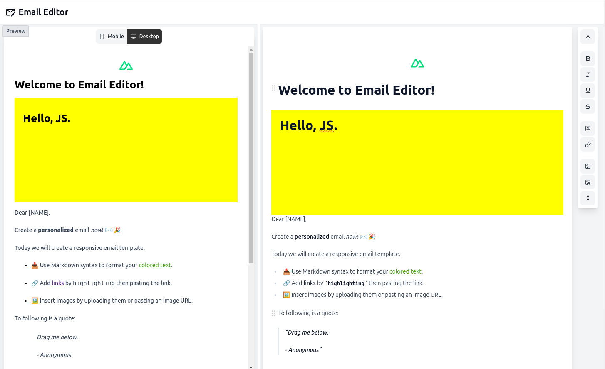

<p style="text-align: center">

</p>
<h1 style="text-align: center">Visual Email Editor</h1>

This project aims to create a visual email editor using TipTap that generates MJML templates. The application is built with Nuxt 3 and Vue.js, providing a user-friendly interface for designing emails.

## Requirements

- Node.js `>=20.15.1`
- TipTap Email Editor

## Features

- Visual Email Editor: Utilize TipTap to create and format email content.
- MJML Template Generation: Convert the content into MJML templates.
- Interactive Previewer: Real-time preview of the email template with options for desktop and mobile views.

## Setup

Make sure to install the dependencies:

```bash
# npm
npm install
```

## Development Server

Start the development server on `http://localhost:3000`:

```bash
# npm
npm run dev
```

## Production

Build the application for production:

```bash
# npm
npm run build
```

Locally preview production build:

```bash
# npm
npm run preview
```

Check out the [deployment documentation](https://nuxt.com/docs/getting-started/deployment) for more information.

### Documentation

For more information on how to use the TipTap Email Editor, refer to the [TipTap Email Editor Documentation](https://tiptap.dev/docs/editor/getting-started/install/nuxt).

For details on MJML templates, check out the [MJML Documentation](https://mjml.io/getting-started-onboard).
